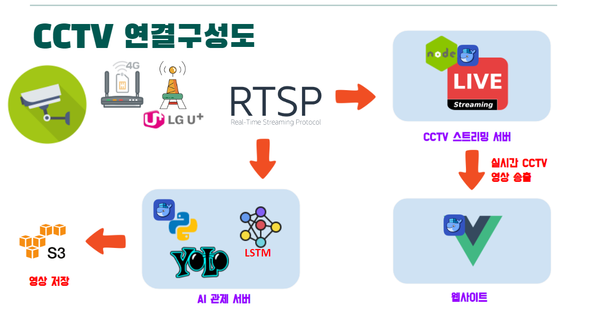
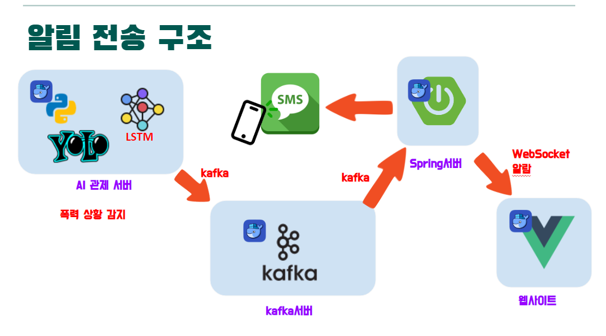
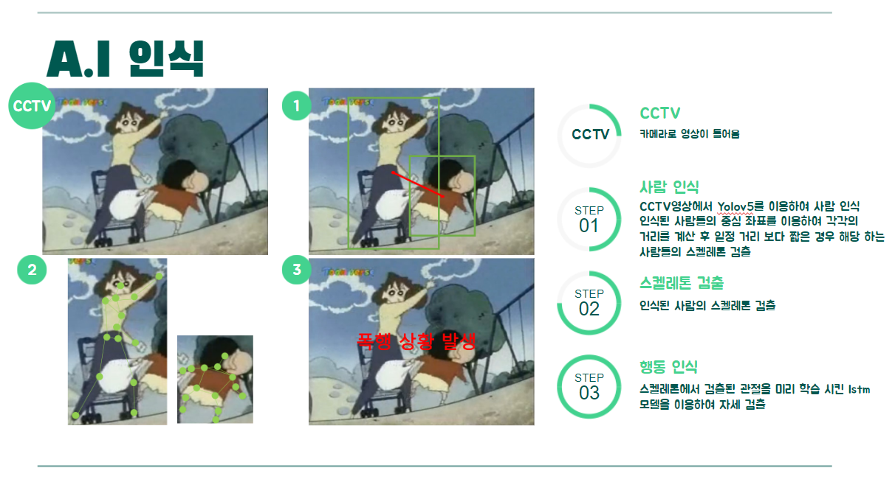
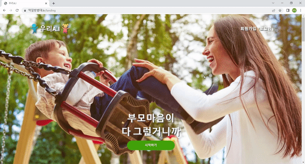
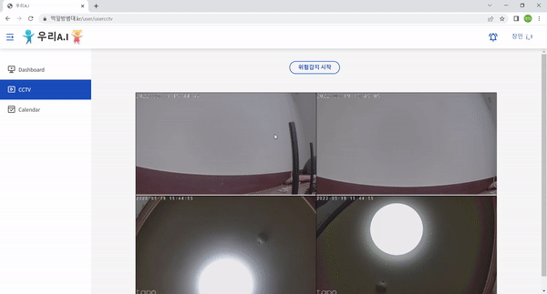
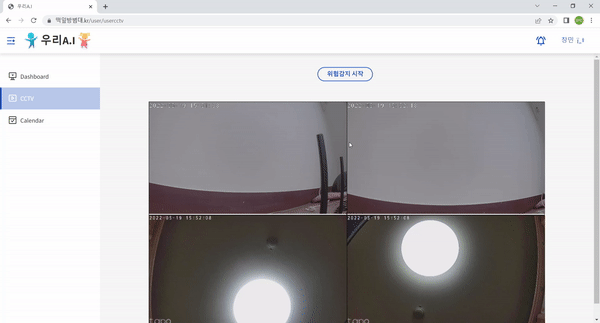
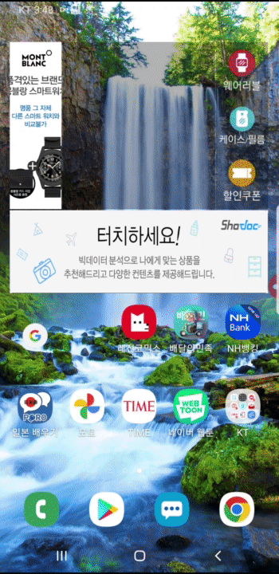
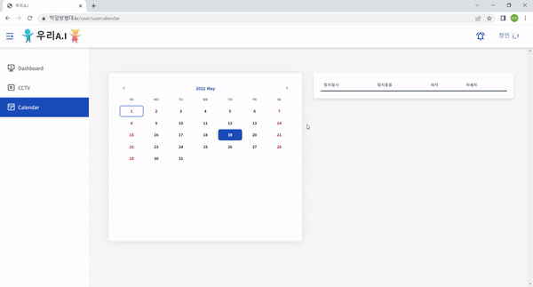
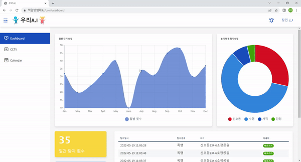

# :video_camera: 떡잎방범대 우리 아이(AI)


## 🚩 스마트 CCTV를 이용한 어린이 놀이터 안전 관리 플랫폼

[](https://img.shields.io/badge/React-61DAFB?style=for-the-badge&logo=React&logoColor=white) [](https://img.shields.io/badge/Spring_Boot-6DB33F?style=for-the-badge&logo=SpringBoot&logoColor=white)  [](https://img.shields.io/badge/Spring_Boot-6DB33F?style=for-the-badge&logo=SpringBoot&logoColor=white) [](https://img.shields.io/badge/MySQL-4479A1?style=for-the-badge&logo=MySQL&logoColor=white)  [](https://img.shields.io/badge/FastAPI-009688?style=for-the-badge&logo=FastAPI&logoColor=white) [](https://img.shields.io/badge/FastAPI-009688?style=for-the-badge&logo=FastAPI&logoColor=white) [](https://img.shields.io/badge/MySQL-4479A1?style=for-the-badge&logo=MySQL&logoColor=white)

 [](https://img.shields.io/badge/FastAPI-009688?style=for-the-badge&logo=FastAPI&logoColor=white) [](https://img.shields.io/badge/MongoDB-47A248?style=for-the-badge&logo=MongoDB&logoColor=white)[](https://img.shields.io/badge/Jenkins-D24939?style=for-the-badge&logo=Jenkins&logoColor=white) [](https://img.shields.io/badge/NGINX-009639?style=for-the-badge&logo=NGINX&logoColor=white) [](https://img.shields.io/badge/Docker-2496ED?style=for-the-badge&logo=Docker&logoColor=white)

##### 진행 기간 : 2022.04.18 ~ 2022.05.20


### 📆 프로젝트 개요

- `우리 아이(AI)`는 놀이터에서 발생하는 폭력, 넘어짐과 같은 안전 위험을 관리하기 위한 스마트 CCTV를 웹 환경에서 제어할 수 있는 플랫폼입니다.
- RTSP를 이용한 실시간 놀이터 감시와 위험 알람 서비스를 제공하고 있습니다.


### 주요 기능

- **지역 별, 시간 별 위험 탐지 통계 자료 제공**

  > 1. **지역 별, 시간 별 위험 탐지 통계 자료**를 제공합니다.
  > 2. **모든 위험에 대한 탐지 상황을 게시판을 통해 확인**할 수 있습니다.
  >
  > - 사용자가 어디 놀이터가 안전하고, 언제 놀이터를 이용하면 좋을지 정보를 확인할 수 있습니다.

- **실시간 감시 및 push 알람 타이머 설정.**

  > 1. RTSP를 이용하여 **웹 환경에서 실시간 CCTV 영상을 모니터링** 할 수 있습니다. 
  > 2. 설정 타이머 시간 범위 내에서 위험이 탐지 되면, SNS 서비스를 통해 **문자 메시지와 웹 push 알람 기능을 제공**하고 있습니다.
  > 3. **폭행, 넘어짐과 같은 위험 상황**을 탐지하여, 사용자에게 서비스를 제공합니다.

- **캘린더를 이용하여 위험감지 상세 정보 열람.**

  > 1. 캘린더를 클릭하여 **해당 날짜에 대한 위험 상황을 확인** 할 수 있습니다.
  > 2. 관제 서버에서 저장한 **위험 탐지 동영상을 디테일 페이지에서 확인** 할 수 있습니다.
  >
  > - Amazon S3에 저장된 url 동영상 파일을 웹 페이지에서 직접 확인 가능합니다.


**✏️[기획서]** : [기능명세서](https://docs.google.com/spreadsheets/d/1Q-ceSbhnGBfOBoElOF0Ky7u79LbKahsTrGg4pNS0-SM/edit#gid=0)     **🖼 [와이어프레임**] : [와이어프레임 확인](https://www.figma.com/file/HQLKt741nyq0yJK378vQTe/%EC%9E%90%EC%9C%A8-figma)     ▶ \[**팀 노션**] : [팀 노션](https://www.notion.so/SSAFY-6-ee2987ff3a0247ac84579c2f04692632)     ▶ [**마인드맵**] :[마인드맵](https://www.mindmeister.com/map/2201310117)


## 🖥️ 시스템 아키텍쳐




## 🖥️ 적용된 기술

#### 1. 알림 전송(Kafka & WebSocket)



- **AI 관제서버에서 위험 상황을 감지하면, 쓰레드를 생성하여 Kafka 서버로 JSON메세지를 발행합니다. **
  - **Spring 서버에서 해당 메세지를 구독하고, JSON 정보를 객체로 받아 SMS 서비스를 제공합니다.**
  - **Spring 서버가 WebSocket 서버로 동작하여, 접속한 클라이언트에 메시지를 broadcasting 합니다.**

------


#### 2. AI (YOLO & LSTM)




## 🎞 서비스 소개

### 1. 로그인 화면

#### 1-1. 로그인 화면



------


### 2. 실시간 Push알림 타이머 설정 화면.

#### 2-1. 타이머 설정 화면



- **[타이머 설정] : ** 사용자는 타이머 설정 시간동안 알람을 전송받을 수 있습니다.

  

#### 2-2. Web Push 알림.



1. **[Kafka 메세징 큐] :** 관제 서버 to 백엔드 서버로 Kafka 메세징 큐를 이용하여 비동기로 알람을 전송합니다.
2. **[WebSocket]** : 백엔드 서버 to 프론트엔드(Server to Client)로 웹 Push Notification 신호를 전달합니다.


#### 2-3. SNS 메시지 위험 알림.



- **[Naver Sens]** : Naver Sens API를 이용하여 타이머가 설정된 모든 유저에게 위험 문자를 전송합니다.

------


### 3. 캘린더 및 디테일 화면.



- **[S3 URL 동영상 확인]** : MP4로 인코딩된 S3 URL 데이터를 jsmpeg를 이용해 브라우저 화면에 직접 출력합니다.

  ------

  

### 4. 위험 탐지 통계 화면.



- **[통계 자료 확인]** : 장소 별, 시간 별 위험 감지 횟수를 그래프 데이터로 확인할 수 있습니다. 

------


## ⚙ 설치 및 실행 방법

#### 인프라 설치 및 실행 방법

- [인프라 세팅](https://sulky-twig-f46.notion.site/8babd4ecfd4b4671858961605c83125a)
- [Jenkins 세팅](https://sulky-twig-f46.notion.site/Jenkins-c9f033b4bf6e4fc690c2aaf8cb674df6)
- [Nginx 세팅](https://sulky-twig-f46.notion.site/nginx-3999e0f28ae24195a68e20c00dc05e5f)

#### FrontEnd(Vue)

```shell
npm install --global yarn
cd frontend
npm i
yarn start(or npm start)
```

#### BackEnd(Spring)

```shell
cd backend/backend-java
./gradlew build -Pprofile=prod
◦sudo java -jar -Dspring.profiles.active=prod [생성된 JAR 파일명].jar
```


## 👤 팀원 정보

- 이정원 - Jeong Won Lee - [sorrow4468@gmail.com](mailto:sorrow4468@gmail.com) - @[sorrow4468](https://github.com/sorrow4468) [Front]
- 손한기 - Han Gi Son - [onegison95@gmail.com](mailto:onegison95@gmail.com) - @[onegi95](https://github.com/onegi95) [Front]
- 이우철 - Woo Cheol Lee - [dncjf1969@naver.com](mailto:dncjf1969@naver.com) - @[dncjf1969](https://github.com/dncjf1969) [Front]
- 반형동 - Hyeung Dong Ban - [bandong92@gmail.com](mailto:bandong92@gmail.com) - @[bandong92](https://github.com/bandong92) [AI]
- 김영기 - Yeong Ki Kim - [dudrl0944@gmail.com](mailto:dudrl0944@gmail.com) - @[yeongki0944](https://github.com/yeongki0944) [Back]
- 김창민 - Chang Min Kim - [sky6min@gmail.com](mailto:sky6min@gmail.com) - @[sky6min](https://github.com/sky6min) [Back]

