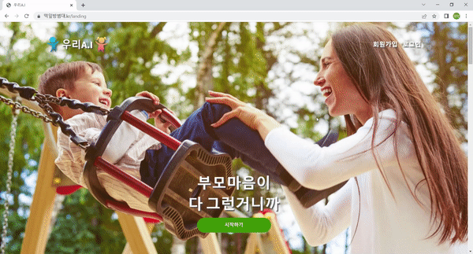
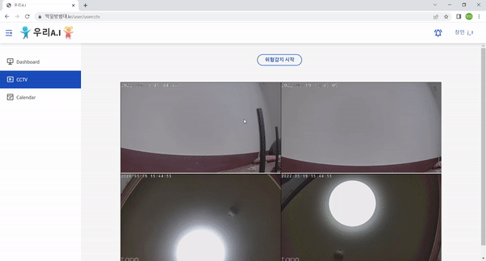
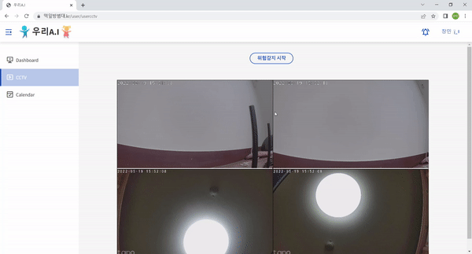
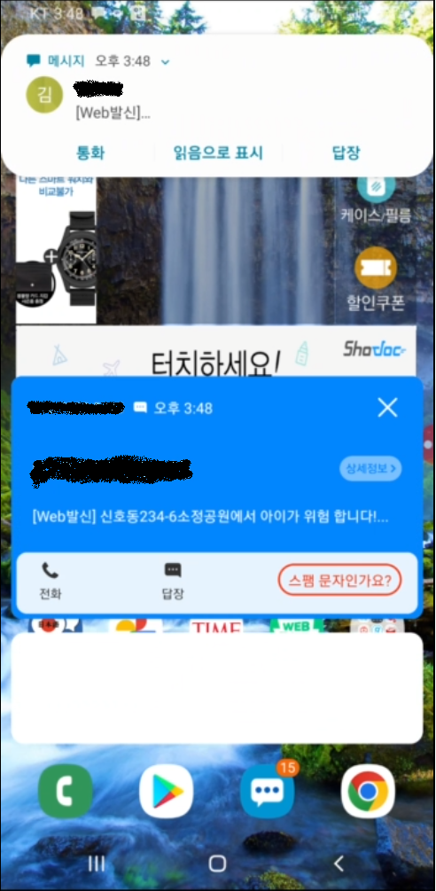
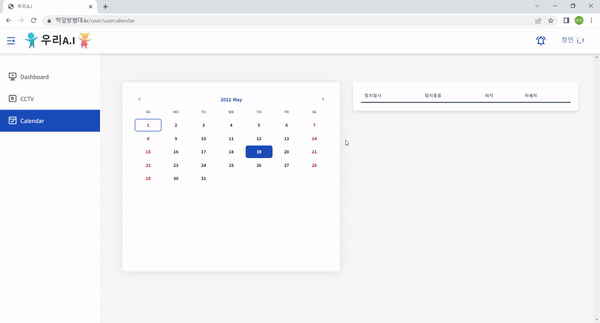
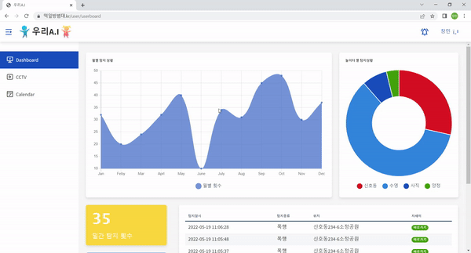

### 1. 로그인 화면

#### 1-1. 로그인 화면

------

### 2. 실시간 Push알림 타이머 설정 화면.

#### 2-1. 타이머 설정 화면

- **[타이머 설정] : ** 사용자는 타이머 설정 시간동안 알람을 전송받을 수 있습니다.

#### 2-2. Web Push 알림.

1. **[Kafka 메세징 큐] :** 관제 서버 to 백엔드 서버로 Kafka 메세징 큐를 이용하여 비동기로 알람을 전송합니다.
2. **[WebSocket]** : 백엔드 서버 to 프론트엔드(Server to Client)로 웹 Push Notification 신호를 전달합니다.

#### 2-3. SNS 메시지 위험 알림.

- **[Naver Sens]** : Naver Sens API를 이용하여 타이머가 설정된 모든 유저에게 위험 문자를 전송합니다.

------

### 3. 캘린더 및 디테일 화면.

- **[S3 URL 동영상 확인]** : MP4로 인코딩된 S3 URL 데이터를 jsmpeg를 이용해 브라우저 화면에 직접 출력합니다.

  ------

### 4. 위험 탐지 통계 화면.

- **[통계 자료 확인]** : 장소 별, 시간 별 위험 감지 횟수를 그래프 데이터로 확인할 수 있습니다.